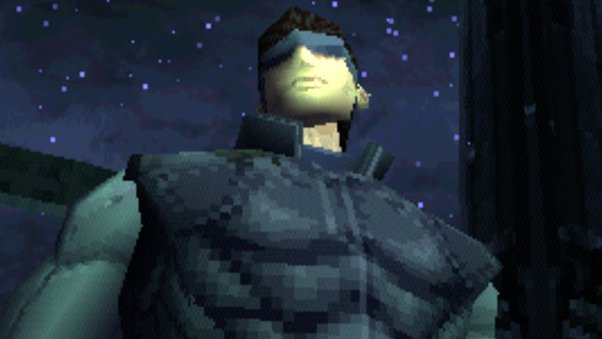
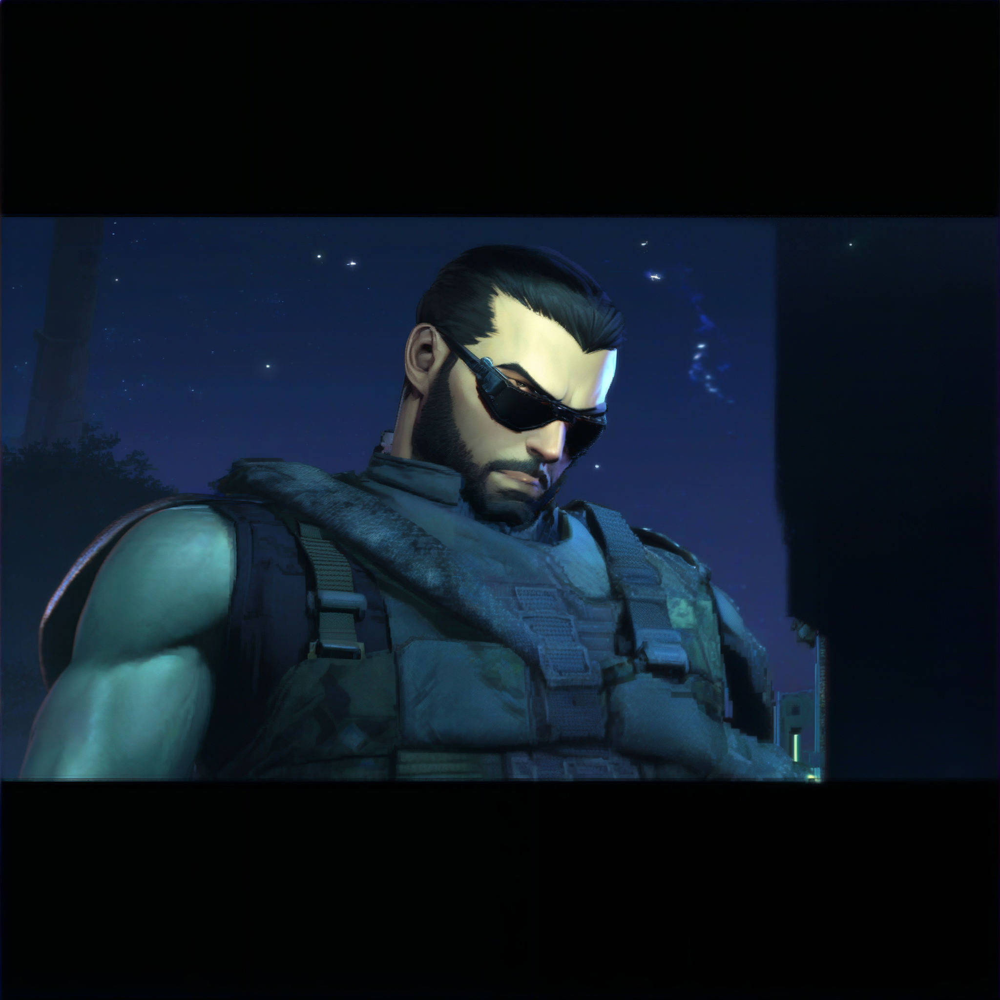

# DemoFusion-Enhance Cog model

This is an implementation of [Enhance-This-DemoFusion-SDXL](https://huggingface.co/spaces/radames/Enhance-This-DemoFusion-SDXL) as a [Cog](https://github.com/replicate/cog) model.

## Development

Follow the [model pushing guide](https://replicate.com/docs/guides/push-a-model) to push your own model to [Replicate](https://replicate.com).

## Basic Usage

Download weights first

    cog run script/download-weights

Then for predictions,

    cog predict -i image=@demo.jpg

## Example

Input

Output

